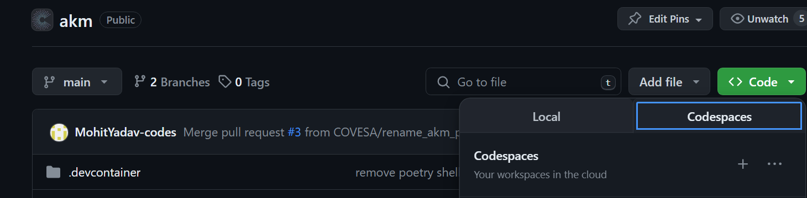

# Automotive Knowledge Model (AKM)
This repo contains the Automotive Knowledge Model (AKM), an open-source data model and metadata catalog for transmitting vehicle signals in a consistent manner.  


- `akm/schema` contains the JSON Schema file(s) that provide the structure and meaning of the automotive metadata files  
- `akm/data` contains the JSON documents that contain the actual Automotive metadata
- `akm/documentation` contains markdown files that explain aspects of the AKM
- `akm/extensions`  contains the extended schema and extended data

This work is still considered alpha development.

# AKM Tools

`akm_tools` provides a set of  tools for parsing, validating, and exporting Automotive Knowledge Model (AKM) data. It can be set up and used either with Poetry or with a DevContainer. Below are the instructions for both methods.

The repo uses poetry for dependecy management for the python based tools. Supported version for python are python>=3.10. Following two metods can be used to setup the development enviornment locally.

## Setup and Use with Poetry

Poetry is a tool for dependency management and packaging in Python. 

1. Install Poetry if you haven't already. You can do this by following the instructions on the [Poetry website](https://python-poetry.org/docs/#installation).

2. Clone this repository to your local machine.

    ```
    git clone https://github.com/COVESA/akm.git
    ```

3. Navigate to the cloned repository.

    ```
    cd akm
    ```

4. Install the project dependencies.

    ```
    poetry install
    ```

5. You can now run the module with Poetry  (without poetry shell)

    ```
    poetry run akm_tools/akm_validator.py
    ```
6. Or with Poetry shell enabled. (normally your terminal prompt will be prefixed with it)

    ```
    python akm_tools/akm_validator.py
    ```

## Setup and Use with DevContainer

A DevContainer, or Development Container, is a reproducible development environment.

1. Install Docker and Visual Studio Code if you haven't already.

2. Install the "Remote - Containers" extension in Visual Studio Code.

3. Clone this repository to your local machine.

    ```
    git clone https://github.com/COVESA/akm.git
    ```

4. Open the cloned repository in Visual Studio Code.

5. Press `F1` to open the command palette and select the "Remote-Containers: Open Folder in Container..." command. Choose the cloned repository folder.

6. The `postCreateCommand` will run `poetry install` automatically to prepare the enviornment.

## Setup and Use with GitHub Codespaces

1. Navigate to the main page of the repository on GitHub.

2. Click the 'Code' button and then click 'Open with Codespaces'. 

    

3. Click on '+ New codespace'. 
 
4. GitHub will create a new Codespace and automatically start setting it up by using the settings defined in the `.devcontainer/devcontainer.json` file in the repository. This includes installing any necessary extensions, setting up the correct runtime environment, and running any postCreateCommand defined.

5. Once the Codespace is ready, you can start working with the code. You can run the module with Poetry:

    ```
    poetry run akm_tools/akm_validator.py
    ```

6. Or with Poetry shell enabled. (normally your terminal prompt will be prefixed with it)

    ```
    python akm_tools/akm_validator.py
    ```

Refer to [akm_tools/README.MD](akm_tools/README.md) for instructions on how to use the tools.