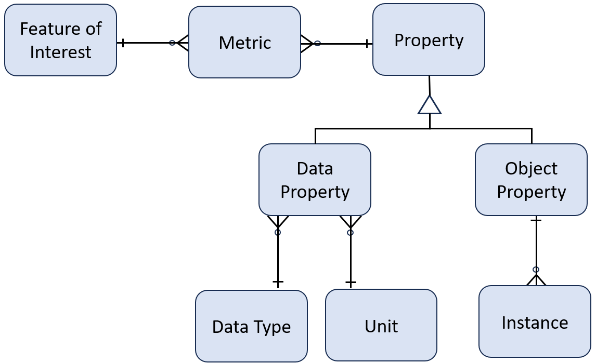

---
title: Overview
weight: 10
chapter: true
---

# Overview
The Automotive Knowledge Model (AKM) is an expressive and extensible semantics and standards-based vocabulary and data model for automobiles.  It is defined in two major sections:
## Schema
The schema describes the AKM data model.  The schema is represented in [JSON Schema](https://json-schema.org/) which provides many benefits:

 - The standard is well-known, documented, and easy to read
 - It has a large ecosystem of [tools and implementations](https://json-schema.org/implementations) such as validators, code generators, and format converters.
 - It provides built-in support for creating an expressive schema with such things as objects, properties, references, arrays,  enumerations, extensions, and regular expressions.
 - It is self-documenting

 ### Diagram
 The diagram below captures most of the classes and their relationships.

## Data
The data includes json files that contain reference data such as standard data types and units, as well as common and generally useful master data such as metrics, features of interest, and properties.
