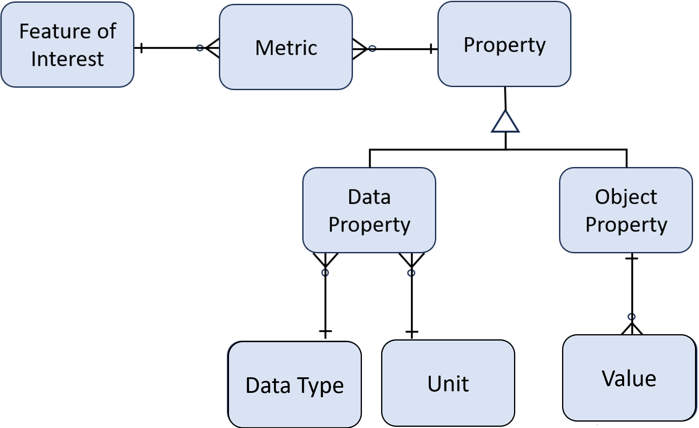

# Overview
The Automotive Knowledge Model (AKM) introduces a data model and metadata catalog for transmitting vehicle signals in a consistent manner.  AKM comprises two major sections:
## Data Model
The data model ensures that objects are described by a standard set of well-defined structures and properties.  The schema is represented in [JSON Schema](https://json-schema.org/) which provides many benefits:

 - The standard is well-known, documented, and easy to read
 - It has a large ecosystem of [tools and implementations](https://json-schema.org/implementations) such as validators, code generators, and format converters.
 - It provides built-in support for creating an expressive schema with such things as objects, properties, references, arrays,  enumerations, extensions, and regular expressions.
 - It is self-documenting

 ### Diagram
 The diagram below captures most of the classes and their relationships.

